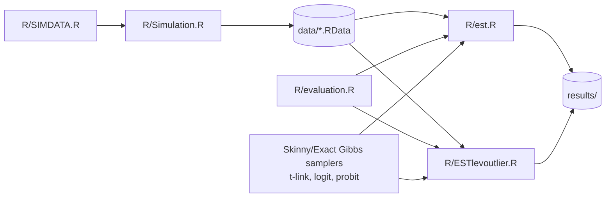

# Skinny Gibbs & Exact Gibbs Variable Selection for Binary Regression

R implementation and simulation study of **Skinny Gibbs** and **Exact Gibbs**
spike-and-slab samplers for Bayesian variable selection in binary-response
regression, under three link functions — **probit**, **logit**, and a
robust **Student-t link** — together with simulation, evaluation, and
outlier-sensitivity experiments comparing these samplers against LASSO-type
competitors (`glmnet`, `hdm::rlassologit`).

## Repository structure

```
.
├── R/          # all source code
├── doc/        # project documentation
├── data/       # simulated datasets (generated; not tracked in git)
└── results/    # experiment output (generated; not tracked in git)
```

### `R/`

| File | Role |
|---|---|
| `SIMDATA.R` | Data-generating functions: design matrix (AR(1)/block correlation), sparse coefficient vector, and binary response under probit/logit/t-link. |
| `Simulation.R` | Driver script that calls `SIMDATA.R` to build train/test datasets across settings (link, correlation structure, `p`, number of active covariates, replicate) and writes them to `data/p<p>/n<n>p<p>case<case>/dflist_<i>.RData`, including leverage-outlier-contaminated copies. |
| `evaluation.R` | Evaluation utilities: `evaluation()` computes sensitivity, specificity, MCC, RMSE(β), MSPE, and accuracy; `glm_t()` fits a t-link GLM by direct likelihood maximization. |
| `SkinyGibbsT.R` / `ExactGibbsT.R` | Skinny Gibbs / Exact Gibbs samplers for the **t-link** model. |
| `SGlogit.R` / `EGlogit.R` | Skinny Gibbs / Exact Gibbs samplers for the **logit** link (via a Student-t approximation to the logistic distribution). |
| `skinny_gibbs_probit.R` / `exact_gibbs_probit.R` | Skinny Gibbs / Exact Gibbs samplers for the **probit** link (Albert–Chib data augmentation). |
| `est.R` | Fits all 13 methods (6 Gibbs samplers × df variants + LASSO/rlasso competitors) and evaluates them under **no outlier** vs. **bad leverage-point outlier** contamination. Writes/reads under `data/` and (optionally) `results/`. |
| `ESTlevoutlier.R` | Same 13-method comparison, but for the **non-leverage (mislabeled response) outlier** scenario. |

### `doc/`

| File | Role |
|---|---|
| `DESC.Rmd` / `DESC.pdf` | Short per-file description (superseded by this README; kept for reference). |

### `data/` and `results/`

Empty placeholders (tracked with `.gitkeep`) for generated simulation
datasets and experiment output respectively. Both are excluded from version
control via `.gitignore` since their contents are reproducible from the code.

"Skinny Gibbs" refers to the fast approximate sampler of Narisetty & He that
updates only the currently-active coefficients each iteration; "Exact Gibbs"
is the corresponding sampler that updates the full coefficient vector.

## Pipeline



1. **Generate data**: run `R/Simulation.R` (sources `R/SIMDATA.R`) to create
   the `data/` folder of simulated train/test sets, including outlier
   variants.
2. **Fit & evaluate models**: run `R/est.R` (no-outlier vs. leverage-outlier
   comparison) or `R/ESTlevoutlier.R` (non-leverage outlier comparison). Both
   scripts `source()` `R/evaluation.R` and the six sampler files, then load
   the `.RData` files produced in step 1 and aggregate metrics across
   replicates.

All scripts use paths relative to the **project root**, so run them (e.g.
via `source()`) with the project root as the working directory, not `R/`.

## Requirements

R (>= 4.0) and the following packages:

```r
install.packages(c(
  "mvtnorm", "Matrix", "mvnfast", "MASS", "invgamma",
  "truncnorm", "caret", "glmnet", "hdm"
))
```

## Usage

```r
# 1. Simulate data (writes to data/...)
source("R/Simulation.R")

# 2a. No-outlier / leverage-outlier comparison
source("R/est.R")        # -> results_Nooutlier, results_Outlier

# 2b. Non-leverage (response) outlier comparison
source("R/ESTlevoutlier.R")  # -> results_lev.outlier
```

